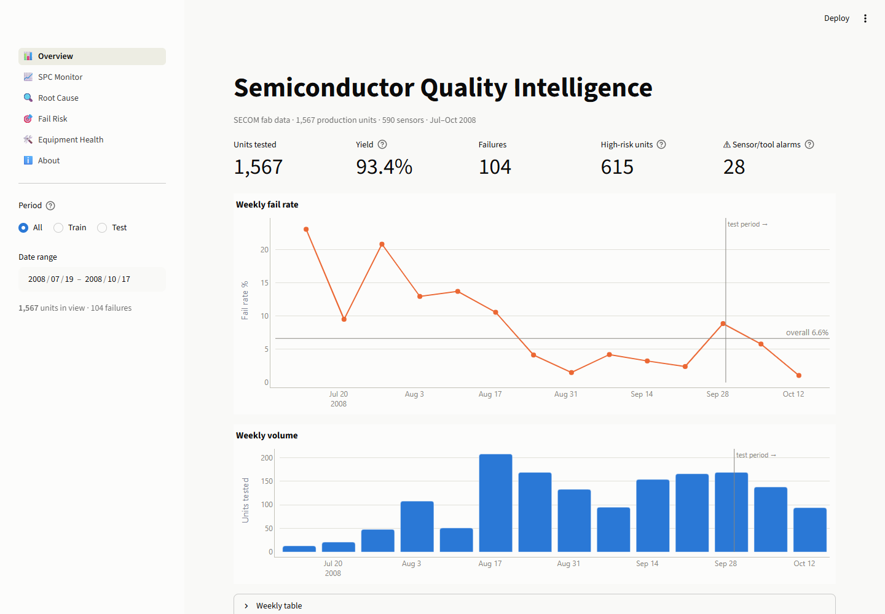
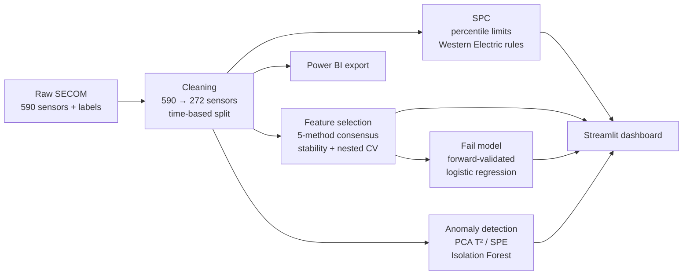
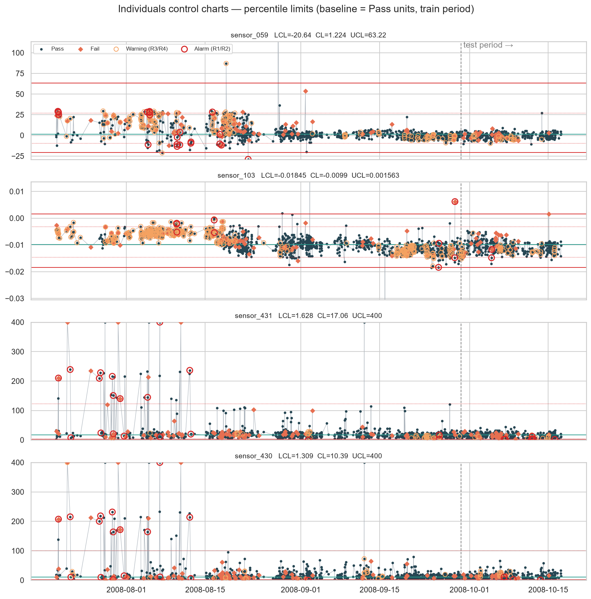
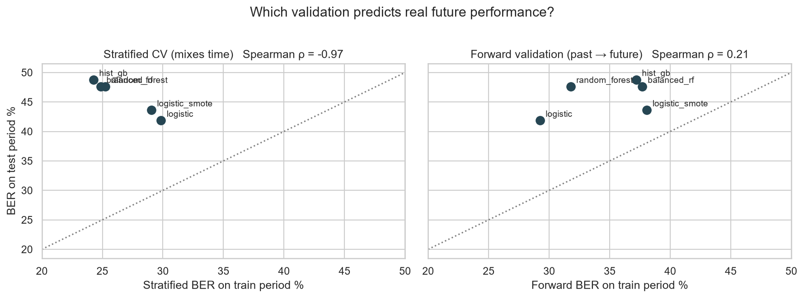
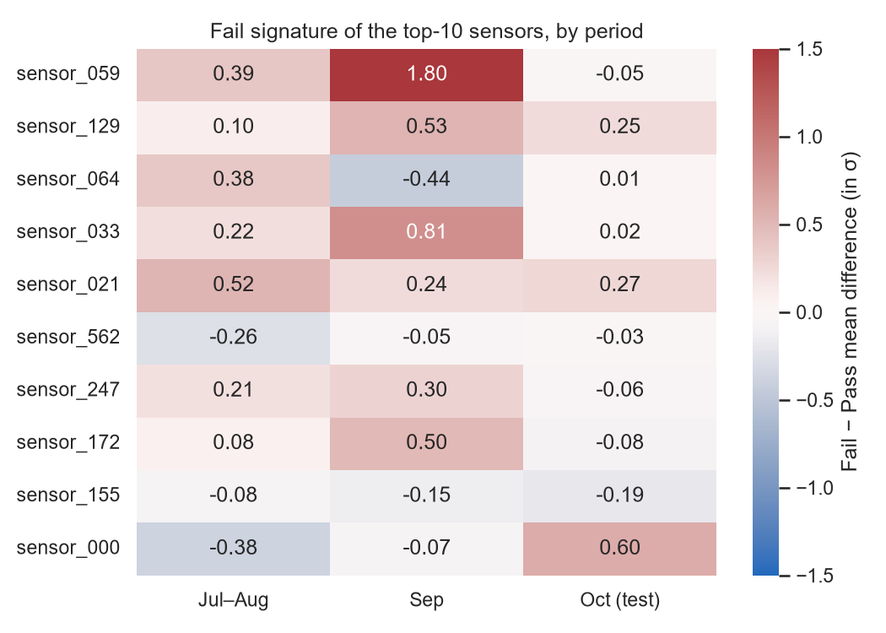
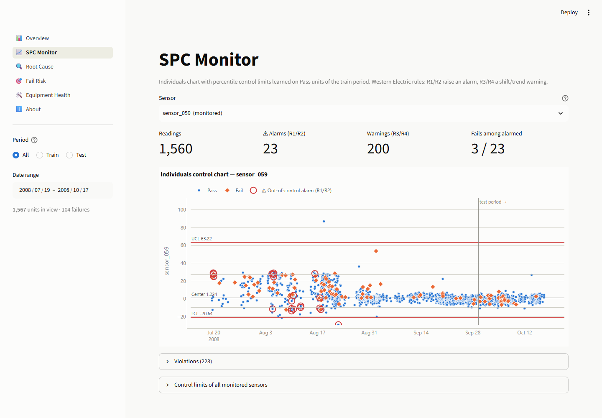
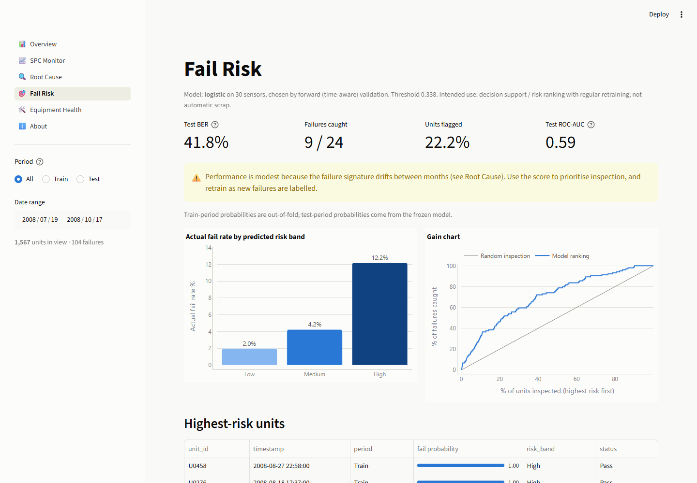
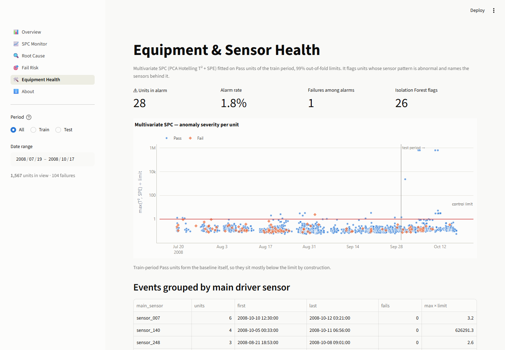

# Semiconductor Manufacturing Quality Intelligence

An end-to-end data analytics and quality-monitoring platform for semiconductor process data: statistical process
control, root-cause analysis, fail prediction and equipment-health monitoring, served in an interactive dashboard.

Built on the public **UCI SECOM** dataset: 1,567 production units from a semiconductor fab, each with 590 sensor
readings and the pass/fail result of in-house line testing (Jul–Oct 2008, 6.6% fail rate).



---

## Highlights

| | Result |
|---|---|
| **Honest evaluation** | Ordinary cross-validation promised a 24% error rate; the same model scored 49% on the following month. Its model ranking was inverted (Spearman ρ = −0.97). Time-aware (forward) validation picked the model that really generalised. |
| **Concept drift, diagnosed** | The #1 failure sensor (`sensor_059`) separates failures by 1.8σ in September and not at all in October. Failure mechanisms change, so models need monitoring and retraining. |
| **SPC that engineers can trust** | Textbook control charts raised false alarms on 3–87% of *good* units (skewed, autocorrelated sensors). Percentile-based limits cut that to ≤ 0.3%. |
| **Root cause** | A consensus of 5 feature-selection methods plus stability selection narrows 590 sensors to 7 stable core sensors. 30 sensors match the accuracy of all 272 cleaned ones. |
| **Equipment health** | Multivariate SPC (PCA T² / SPE) automatically found a sensor logging ≈ 9999 error codes and a short tool excursion, and named the responsible sensor each time. |
| **Engineering** | Leakage-free sklearn pipelines, one-command rebuild, 55 automated tests, reproducible to the last digit, pinned environment. |

---

## Architecture



Every step is a tested Python module in [`src/`](src/) with a matching notebook in [`notebooks/`](notebooks/).
All decisions (sensors to drop, medians, scaling, limits, feature ranking, thresholds) are learned on the
**train period only** (19 Jul – 29 Sep, 1,175 units) and evaluated on the **later, unseen test period**
(29 Sep – 17 Oct, 392 units).

---

## The pipeline, step by step

### 1 · Data understanding — [notebook 01](notebooks/01_data_understanding.ipynb)
- 104 of 1,567 units fail (6.6%), so accuracy is meaningless. Metrics used: balanced error rate (BER), recall, PR-AUC.
- 116 constant sensors, 28 sensors with more than 50% missing values, scales from 0.002 to 38,000.
- **Yield is not stable:** the weekly fail rate falls from ~22% in July to ~3% in September.

### 2 · Cleaning pipeline — [`src/preprocessing.py`](src/preprocessing.py), [notebook 02](notebooks/02_cleaning_pipeline.ipynb)
- scikit-learn pipeline: drop high-missing → drop constant → median impute → drop near-duplicates (|r| > 0.95) → scale.
- **590 → 272 sensors**, fitted on the train period only, with a chronological split (no future leakage).

### 3 · Statistical process control — [`src/spc.py`](src/spc.py), [notebook 03](notebooks/03_spc_monitoring.ipynb)
- Individuals charts with limits learned on known-good units, Western Electric rules R1–R4.
- Textbook I-MR limits fail on real fab data; **percentile (ISO 22514-style) limits** fix the false alarms.
- Result: SPC alarms raise fail risk ~1.5× but catch only ~1 in 5 failures, so yield prediction needs a multivariate view.



### 4 · Feature selection — [`src/feature_selection.py`](src/feature_selection.py), [notebook 04](notebooks/04_feature_selection.ipynb)
- t-test, mutual information, L1 logistic, random forest and SHAP rankings combined into a consensus.
- Bootstrap stability: `sensor_059` and `sensor_129` stay in the top 20 in **100%** of subsamples.
- Nested CV (ranking redone inside every fold): 30 sensors → BER 30.9% vs 30.3% with all 272 (published SECOM baseline: 33.5%).

### 5 · Fail prediction — [`src/model.py`](src/model.py), [notebook 05](notebooks/05_fail_prediction.ipynb)
- 5 candidates (logistic, logistic + SMOTE, random forest, balanced RF, gradient boosting).
- Stratified CV vs **forward validation**: only the time-aware scheme predicted real future performance.



| Test period (unseen) | Value |
|---|---|
| Balanced error rate | **41.8%** (95% CI 30.6–50.9%) |
| Failures caught | **9 / 24** while flagging 22% of units |
| ROC-AUC | 0.59 (95% CI 0.48–0.71) |
| Inspect the top 20% riskiest units | catch 8 of 24 failures (1.7× random) |

The model is deliberately documented as a **risk-ranking aid, not an auto-scrap rule** ([model card](models/model_card.json)).



### 6 · Anomaly detection — [`src/anomaly.py`](src/anomaly.py), [notebook 06](notebooks/06_anomaly_detection.ipynb)
- PCA Hotelling T² and SPE (Q) with out-of-fold 99% limits, Isolation Forest as a second opinion, per-sensor contributions.
- October's failed units look **normal** in sensor space (0/24 caught, AUC ≈ 0.5). Together with step 5 this points to a
  root cause outside these 590 sensors, so the next action is to widen data collection.
- It does catch **equipment/sensor events** on passing units: `sensor_140` logging ≈ 9999 values and a two-day `sensor_007` burst.

### 7 · Dashboard — [`app/`](app/)

| Overview | SPC Monitor | Fail Risk | Equipment Health |
|---|---|---|---|
|  |  |  |  |

Six pages: KPIs and yield trend, per-sensor control charts, root-cause ranking and drift heatmap, risk bands with
per-unit explanations and **CSV upload scoring**, equipment-health events with sensor contributions. A shared
period/date filter drives every page; colours come from a colour-blind-validated palette and every chart has a table view.

A [Power BI export](powerbi/) (star-schema CSVs + build script) is included for BI users.

---

## Run it locally

Requires Python 3.13.

```bash
git clone <this-repo>
cd <this-repo>
python -m venv venv
venv\Scripts\activate            # Windows  (macOS/Linux: source venv/bin/activate)
pip install -r requirements-dev.txt

streamlit run app/dashboard.py   # dashboard at http://localhost:8501
python -m pytest                 # 55 tests
python -m src.pipeline           # rebuild every artifact from raw data (~7 min)
```

The dashboard works straight after cloning: the small artifacts it needs (~4.5 MB of predictions, scores and models)
are committed, and `python -m src.pipeline` reproduces them exactly.

---

## Project structure

```
├── app/                  Streamlit dashboard (data layer, Plotly charts, pages)
├── data/raw/             UCI SECOM files
├── data/processed/       pipeline outputs used by the dashboard
├── models/               fitted pipelines, anomaly detector, model card
├── notebooks/            01–06: analysis narrative with results
├── powerbi/              Power BI-ready CSV export
├── reports/figures/      charts and dashboard screenshots
├── src/                  data_loader · preprocessing · spc · feature_selection · model · anomaly · pipeline
└── tests/                55 pytest tests (unit, leakage, pickling, dashboard smoke tests)
```

## Tech stack

Python · pandas · NumPy · SciPy · scikit-learn · imbalanced-learn · SHAP · Streamlit · Plotly · Matplotlib/Seaborn · pytest · Power BI

---

## Limitations

- The test period contains only **24 failures**, so every test metric carries a wide confidence interval (reported).
- Sensor names are anonymised in SECOM, so findings point to *which* signal to investigate, not its physical meaning.
- The failure mechanism drifts over time; in production the model would need scheduled retraining and drift monitoring.

## License

Code: [MIT](LICENSE). Dataset: CC BY 4.0 (see below).

## Data

McCann, M. & Johnston, A. (2008). *SECOM* [Dataset]. UCI Machine Learning Repository.
https://doi.org/10.24432/C54305 — licensed under CC BY 4.0.
